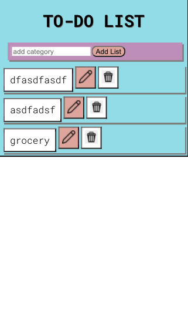
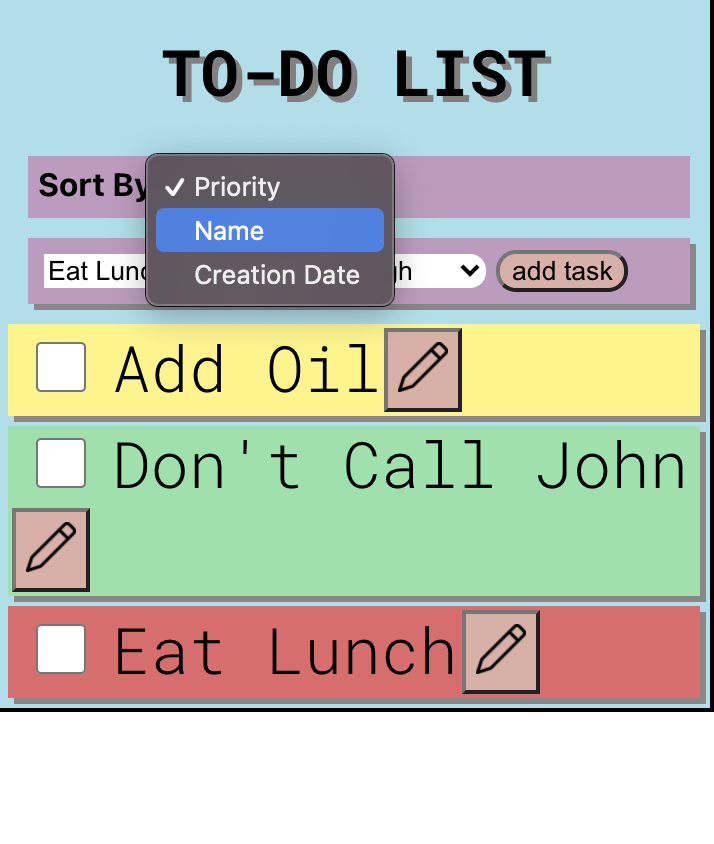

# CS124 LAB 1 
Authors: 
[Noah Smith](https://github.com/noahsmitty) and [Kripesh Ranabhat](https://github.com/kripeshr22)

## Our Design Decisions
----
### NEW DESIGN FROM LAB 4

### MULTIPLE LISTS
We have added a list of lists like functionality to account for multiple lists. Initially, you land on the home page which has a list of what we're calling "lists/categories", that can be edited and deleted.
A new category can also be added. Upon clicking on these "lists/categories", we are taken to another page where we can see the list items inside that category. 

----
### FROM LAB 3
### 1. ADD TASK
For our add task component, we've moved it to the top of the page because as the number of tasks
grow, we would have to scroll all the way down if we wanted to add a new task. By moving it to the top, it is easier to add tasks
and given that adding a task might be a task that a user might want to do first and more frequently, this design change made sense to us.

### 2. EDIT/RENAME TASK
For editing/renaming a task, we have a button with a marker pen next to all the tasks.

Upon clicking on the edit button, an alert pops up which takes over the screen. It has an 
input field to change the description to, a priority selector and two buttons, one to confirm (OK),
the other to cancel the changes.

### 3. SHOW ALL/DELETE ALL
Hide Completed and Deleted Completed buttons operate on the same list of completed tasks.
The buttons don't show up initially when no tasks are selected.

When an item is selected, both Hide Selected and Delete Selected buttons show up because both are valid options and operations that we can perform on the selected item.

When the completed tasks are hidden, only the show completed button will be available because we don't want to unintentionally delete a large number of items without knowing what we are deleting.

### 4. PRIORITY AND SORTING
For the Priority task, we decide on 3 levels of priority, i.e High, Low and Medium. They are 
portrayed by what color the task is. Red is High, Yellow is Medium and green is low priority. 

There are 3 options to sort the list of tasks by. They can be selected from a dropdown menu as such:

Selecting either Priority, Name or creation date should give you a list of tasks sorted by the selected parameter.

