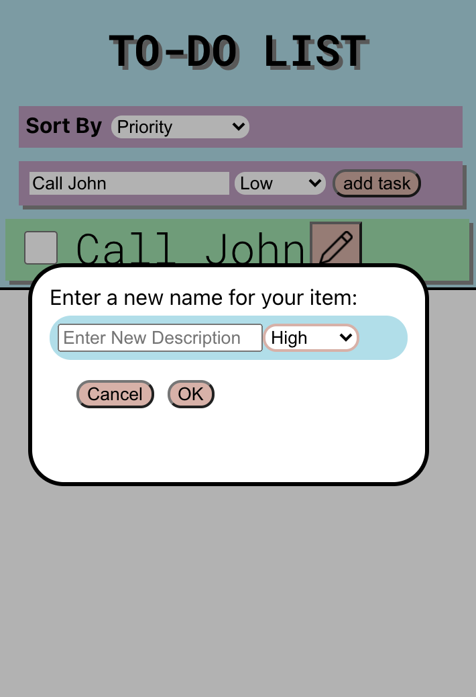

# CS124 LAB 1 
Authors: 
[Noah Smith](https://github.com/noahsmitty) and [Kripesh Ranabhat](https://github.com/kripeshr22)

## Our Design Decisions
----
### NEW DESIGN FROM LAB 5

#### 1. SUPPORT LOGIN
First, we wanted to implement users and login + sign up functionality. We created a login page and a signup page, each differentiated by easily clickable tabs, with a simple field for an email and password to sign up, or the option to sign up with Google as well. Here is what both of these screens look like:

Upon login or sign up, the user is navigated to the List view, where they can add, edit, or remove their to-do lists. 

#### 2. SUPPORT SHARING

In order to implement sharing of lists between users, we decided on the following:

1. Designate an owner for every list (whoever creates it).
2. If shared with another user, the other user can't delete the shared list. Only the owner can delete the list.
3. Create a share button that will bring up a modal to share it with another user, where the user types in the email.
4. Universal sharing is allowed, once a list is shared to a user, that user can also share it with other users.
5. Shared lists are distinguishable from unshared lists, by an additional people icon.
6. Clicking on the people icon displays a modal with a list of all users that have access to the shared list.
7. Sharing is automatic, there is no need to accept it.

For each list item, we added two additional buttons alongside the preexisting edit and delete buttons. These buttons allow the user to share their list with another user, or to indicate whether the list is already shared, and to view what users have access. Here is a what the new list items page looks like:

Notice how the shared list has an additional "people" icon.
When the user clicks on the share button, this is what they see:

Then, if a list has been shared, here is what happens when they click on the people icon:

Notice, the number of users that have access is displayed, as well as each user in a list.

Nothing else in the task list has been changed since Lab 4.

#### Challenges
We had some challenges navigating the correct firebase rules to properly enable sharing. We also found it difficult to properly manipulate shared data.

----
### FROM LAB 3
### 1. ADD TASK
For our add task component, we've moved it to the top of the page because as the number of tasks
grow, we would have to scroll all the way down if we wanted to add a new task. By moving it to the top, it is easier to add tasks
and given that adding a task might be a task that a user might want to do first and more frequently, this design change made sense to us.

### 2. EDIT/RENAME TASK
For editing/renaming a task, we have a button with a marker pen next to all the tasks.

Upon clicking on the edit button, an alert pops up which takes over the screen. It has an 
input field to change the description to, a priority selector and two buttons, one to confirm (OK),
the other to cancel the changes.

### 3. SHOW ALL/DELETE ALL
Hide Completed and Deleted Completed buttons operate on the same list of completed tasks.
The buttons don't show up initially when no tasks are selected.

When an item is selected, both Hide Selected and Delete Selected buttons show up because both are valid options and operations that we can perform on the selected item.

When the completed tasks are hidden, only the show completed button will be available because we don't want to unintentionally delete a large number of items without knowing what we are deleting.

### 4. PRIORITY AND SORTING
For the Priority task, we decide on 3 levels of priority, i.e High, Low and Medium. They are 
portrayed by what color the task is. Red is High, Yellow is Medium and green is low priority. 

There are 3 options to sort the list of tasks by. They can be selected from a dropdown menu as such:

Selecting either Priority, Name or creation date should give you a list of tasks sorted by the selected parameter.

